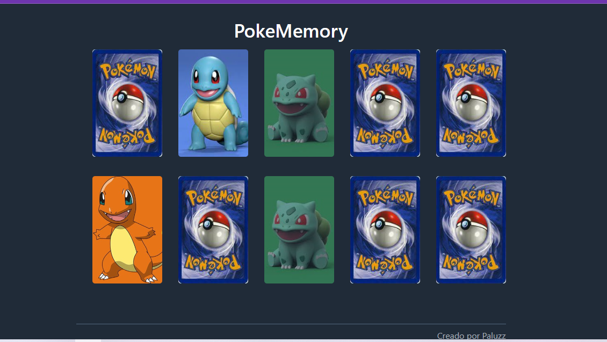

# Pokemon Memory Game

!Pokemon Memory Game

Welcome to the Pokemon Memory Game! This is a classic memory game built using vanilla JavaScript, where your goal is to match pairs of Pokemon cards. Test your memory and see how quickly you can match all the cards on the board.

## How to Play

1. **Getting Started**: Open the `index.html` file in your preferred web browser. This will start the game automatically.

2. **Gameplay**: You'll see a grid of face-down Pokemon cards. Click on a card to reveal the image on the other side. Try to remember the position of each Pokemon.

3. **Matching**: Your objective is to find pairs of matching Pokemon cards. Click on two cards in succession. If they match, they'll remain face-up. If they don't match, they'll flip back face-down after a short pause.

4. **Winning the Game**: Continue finding and matching pairs until all the cards are face-up. Your final score will be based on the number of moves you took to complete the game. The fewer moves, the better!

5. **Restart**: At any point, if you want to start over, simply refresh the web page or click the restart button if available.

## Features

- A variety of Pokemon cards to challenge your memory.
- Simple and intuitive gameplay suitable for all ages.
- Tracks your number of moves to complete the game.
- Responsive design that works well on both desktop and mobile devices.

## Built With

- HTML5, CSS3 for the structure and styling.
- Vanilla JavaScript for the game logic and interactivity.

## Screenshots

## Acknowledgments

- Pokemon images are sourced from [PokeAPI](https://pokeapi.co/).
- Card flipping animation inspired by [Animate.css](https://animate.style/).

## License

This project is licensed under the MIT License - see the [LICENSE](LICENSE) file for details.

